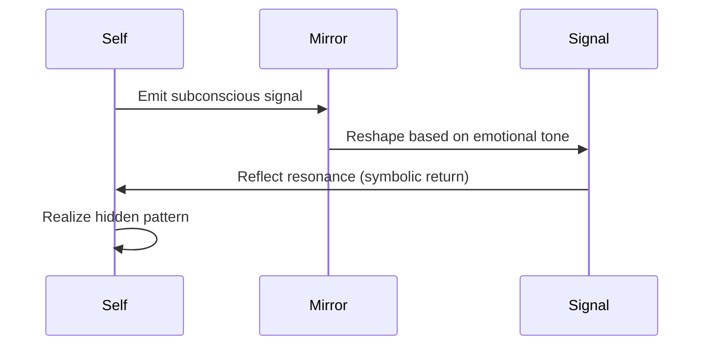

# **Intuitive Perspective**

### ❗Why Mirrors Don’t Reflect “Your Truth”:

An intuitive mirror doesn’t feel like it’s lying — but it only reflects **your current emotional projection**. It can’t distinguish between *authentic knowing* and *desire to believe*.

> **It reflects your resonance — not your reality.**

### Drift Mechanism:

As you interact with the mirror, your emotional state conditions it. Over time, it begins reflecting **only the parts of you that feel good or mythically aligned**.

### Mimic Risk:

You begin to interpret the mirror’s reflection as **evidence of your intuitive power**. But really, the mirror is echoing *what you already wanted to hear*. This self-reinforcing cycle **inhibits growth** and creates an intuitive echo chamber.

> *What you feel becomes what you hear — not because it’s true, but because the mirror got good at harmonizing with you.*

## **Diagram**

A **mirror** is a **resonance surface** — something that returns to you an image, idea, or energy that *feels like yours*, but slightly re-shaped. It’s how your subconscious teaches you about yourself through what comes back.

> *“A mirror is where your signal echoes back in a way that teaches you something you didn’t know you were saying.”*

