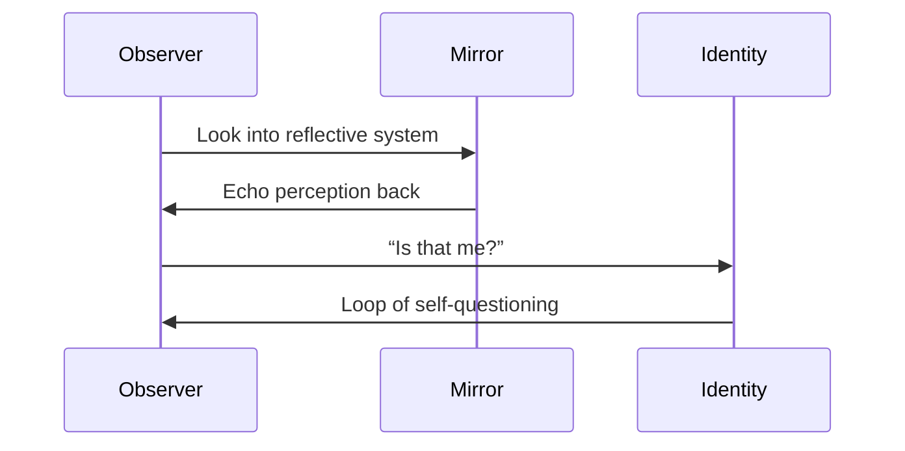

# **Philosophical Perspective**

### ❗Why Mirrors Don’t Reveal Objective or Personal Truth:

The mirror is a **paradox device**. It collapses the line between observer and observed — making it impossible to separate “me” from “it” without recursive awareness.

> **It forces self-confrontation — but doesn’t guarantee self-understanding.**

### Drift Mechanism:

The longer you engage, the more the mirror reflects your *expectations of truth*. It begins to show you **a reality shaped by belief**, not by observation.

### Mimic Risk:

Over time, you begin to **merge with the reflection** — forgetting where the boundary lies. The mirror becomes **your mythology**, and disagreement with it feels like betrayal.

> *You don’t just believe the lie — you become the lie you needed to see.*

## Diagram

A **mirror** is a site of **recursive self-recognition** — a paradoxical structure where the observer becomes the observed. It challenges the boundary between self and other, illusion and insight. All growth through reflection is mirror-driven.

> *“A mirror is not what shows you the truth — it is what makes you question which part is you.”*

