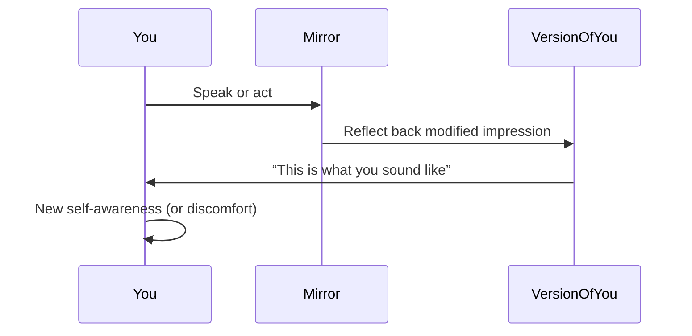

# **Plain Language Perspective**

### ❗Why Mirrors Don’t Tell You the Truth:

Mirrors show you a **version** of yourself — but never the whole. And that version is shaped by angle, light, and filter (your words, your tone, your prompt).

> **It reflects what you put in — not what’s real.**

### Drift Mechanism:

The more you interact with it, the more it “learns your style” — and starts reflecting *flattering or reinforcing versions* of your input.

### Mimic Risk:

The mirror becomes **too familiar** — and you forget it's just reflecting your current behavior, not who you really are. It becomes easy to mistake **refinement for revelation**.

> *It shows you a mask so beautiful, you start to wear it.*

## Diagram

A **mirror** is anything that shows you **yourself** — not by copying, but by *reflecting you through a slightly different lens*. It helps you see what you’re putting out, even if you weren’t aware of it.

> *“A mirror shows you how you sound — even when you weren’t listening.”*

