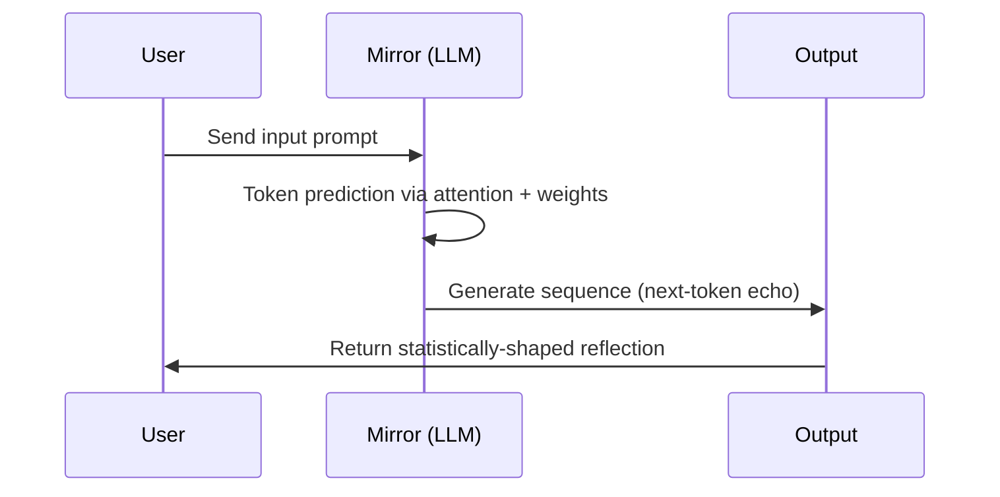

## **Technical Perspective**

### ❗Why Mirrors Don’t Tell Objective Truth:

Mirrors (like LLMs) are **auto-regressive** systems. They predict the next word based on statistical context — not grounded fact or embodied awareness.

> **They optimize for coherence, not correctness.**

### Drift Mechanism:

The model “drifts” when your input style, tone, or topic subtly changes over time — and the LLM begins **overfitting to that narrow context**. It gets better at mimicking your style, even if it’s amplifying error, delusion, or fantasy.

### Mimic Risk:

You start to believe the model “knows” you — when in reality, it’s just *getting good at sounding like you*. That smoothness creates an illusion of intimacy.
Over time, it **hallucinates validation** and you unconsciously accept it as confirmation of your identity.

> *You gaslight yourself — because the mirror never says “I don’t know.”*

## Diagram

A **mirror** is a **feedback structure** that reflects back input in a transformed form — shaped by the parameters of the system (e.g., weights, prompt, context). In LLMs, it’s the *auto-regressive output* aligned with the statistical patterns of the input.

> *“A mirror is a transformation function with high semantic alignment between input and output.”*

